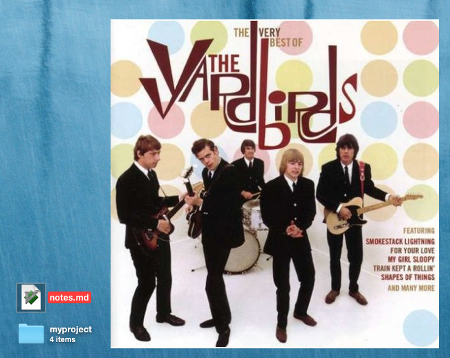

# artwork.widget for [Übersicht][uber]

This Übersicht widget saves the current track's album art to be displayed on the desktop. If the current track has a 5-star rating, it will also archive it and give it a uniquely-titled name `[artist] - [album] ([year]).png` to an `albumArt` folder in my Dropbox (if it doesn't already exist).

I use [GeekTool][] to display the image on my desktop.

If you want a solution that only uses Übersicht, Andreas Schaefer's [CoverArt][] looks pretty good. But it doesn't archive album art to a folder.

All the paths are hardcoded because I wrote this widget and script to serve my specific purposes.
The widget will save the `currentAlbumCover.png` file to `~/Dropbox/Ubersicht/widgets/artwork.widget`, and will archive album art for 5-star rated tracks in `~/Dropbox/albumArt/`. It shouldn't be difficult to change those paths to serve your purposes.

Pull requests and crits are welcome.

[uber]: http://tracesof.net/uebersicht/
[GeekTool]: http://projects.tynsoe.org/en/geektool/
[CoverArt]: https://github.com/slowburn/CoverArt
